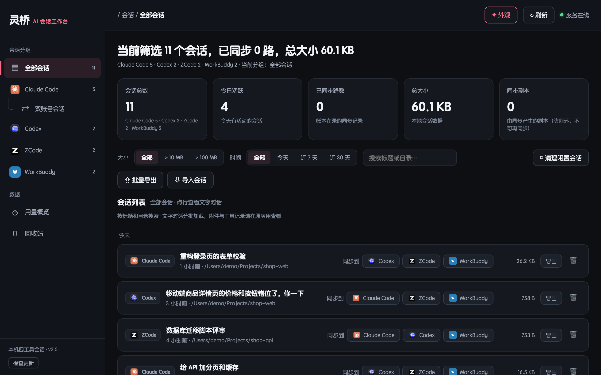
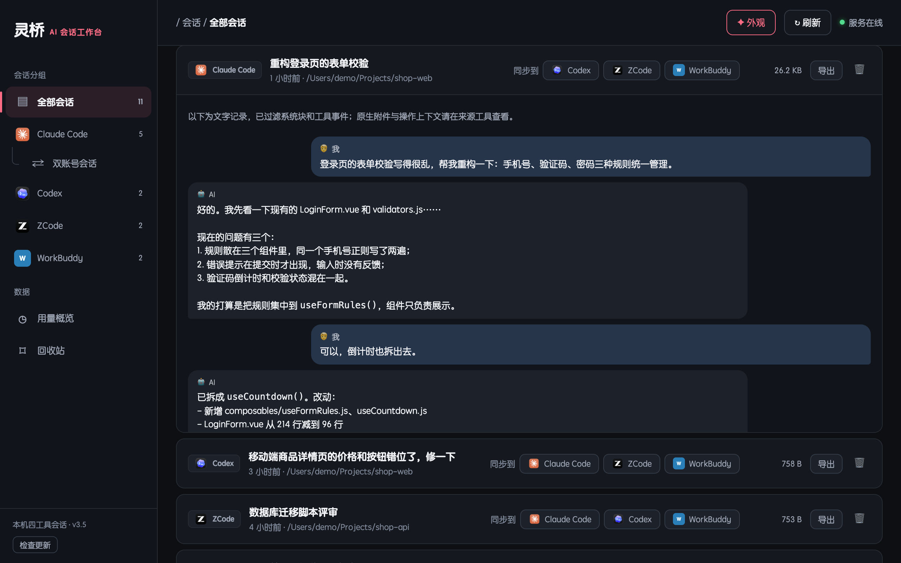
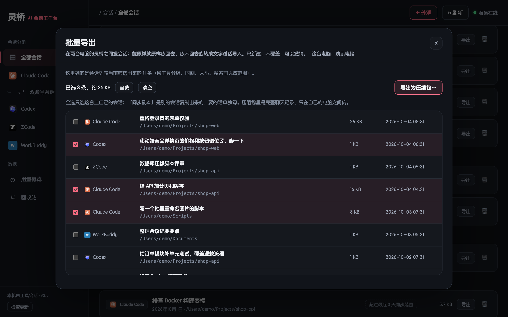
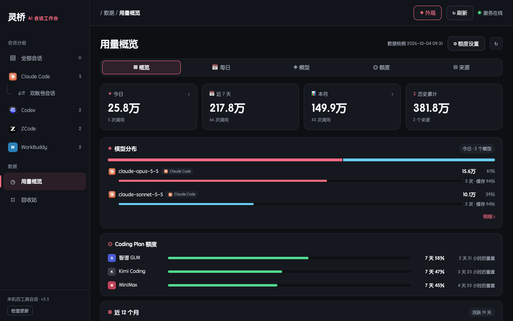

# 灵桥 · 多平台 AI 会话管理器

一个 macOS 原生窗口应用，把 **Claude Code、Codex、ZCode、WorkBuddy** 四个 AI 编程工具的本地会话放在一起管：浏览、搜索、在工具之间转、在两台 Mac 之间搬，顺便看看各家编程套餐还剩多少额度。

所有东西都在你自己的电脑上跑，不经过任何服务器。



## 能做什么

- **一处看全部会话**：四个工具的会话按时间排在一起，可以按工具、天数、大小筛选，按标题和目录搜索；点开就能看完整对话，长对话分页加载。
- **跨工具接着聊**：在 Claude Code 里聊到一半的会话，可以转成文字对话放进 Codex、ZCode 或 WorkBuddy（四个工具两两之间，12 个方向），在那边接着聊。重复转不会出现两份。
- **两台 Mac 之间搬会话**：每条会话旁边有「导出」，打成一个压缩包；在另一台 Mac 的灵桥里「导入会话」。两边工具版本一样就原样放回去（会话 ID 不变），不一样就转成文字对话导入。导入前先预览，导完可以整次撤销。
- **清理**：按 15 / 30 天没动过挑出闲置会话，也可以只清子代理（subagent）对话；先预览、逐条勾选，删掉的进回收站，能恢复。
- **套餐用量**：智谱 GLM、Kimi、MiniMax 编程套餐的剩余额度（密钥存在 macOS 钥匙串里），加上 Claude Code、ZCode、WorkBuddy、CC Switch 的本地 token 用量，按天、按模型统计；菜单栏能直接看到剩余百分比。
- **Claude Code 双账号**：Claude 桌面版切换账号后，侧栏只显示当前账号的会话。灵桥可以把另一个账号的会话条目补过来，写之前先整份备份，能撤销。
- **外观**：五套皮肤、四种字体，标题栏跟着变色。
- **检查更新**：从 GitHub 克隆安装的，侧栏底部点「检查更新」就能更新；更新前先在本机跑一遍测试，没通过自动退回。
- **插件**：可以在 `plugins/` 里放自己的插件，见 [plugins/README.md](plugins/README.md)。

| 会话内容 | 两台 Mac 之间搬会话 | 套餐用量 |
|---|---|---|
|  |  |  |

## 系统要求

- macOS，Apple 芯片（M1 及以后）。在 macOS 26 + Apple M4 上开发和测试。
- Python 3.10 或更新的版本，推荐用 Homebrew 装 Python 3.13。
- git：从 GitHub 克隆和「检查更新」要用。装了 Xcode 命令行工具就有（终端里运行 `xcode-select --install`）。
- 四个工具不用都装，装了哪个就显示哪个。

## 安装

```bash
git clone https://github.com/fangfazz0413-byte/lingqiao.git
cd lingqiao
bash install.sh
```

`install.sh` 会：

1. 找到 Python；
2. 在 `.bridge/runtime` 里建一个只给灵桥用的环境，装好依赖（pywebview 等，版本固定在 `app/requirements-desktop.txt`）；
3. 从你已经装好的 Claude、Codex 等 App 里提取图标。

装好后双击 `会话桥.app` 打开，可以把它拖到程序坞。

> 也可以在 GitHub 页面上点 Code → Download ZIP，解压后同样运行 `bash install.sh`。这样装的不能用「检查更新」，以后要手动下载新版本。

## 更新

- 灵桥侧栏底部点「检查更新」，有新版本就点「更新」：
  - 本机改过程序文件，或者两边都改过的，会停下来说明原因，不会自动覆盖；
  - 更新时会先跑测试，没通过就自动退回原来的版本；
  - 会话、设置这些数据不受影响。
- 或者在灵桥文件夹里运行 `git pull`，再重新打开灵桥。

## 数据和安全

- **只在本机运行**：
  - 窗口里的页面只监听 `127.0.0.1`，每次启动生成随机口令，还会核对请求的 Host 和来源，别的网页和程序调不了。
  - 会话内容不会上传到任何地方。
- **会联网的只有三件事**：
  - 查套餐额度：只连你填了密钥的那几家；
  - 检查更新：连 GitHub，可以关掉；
  - 安装时用 pip 下载依赖。
- **灵桥自己的数据都在 `.bridge/` 里**：索引、操作日志、回收站、备份、设置。这个文件夹不进 Git。
- **改其他工具的数据前先留后路**：
  - 每次同步、导入、删除都先写恢复日志；
  - 删掉的会话进回收站；
  - 中途被关掉，下次启动时自动补偿。
- **往 Claude 桌面版写侧栏条目前，要先退出桌面版**（⌘Q），不然它会把改动覆盖回去。

## 注意

- 灵桥是个人做的非官方工具，和 Anthropic、OpenAI、智谱、腾讯、Kimi、MiniMax 等公司都没有关系。各工具和图标的商标归各自所有者。
- 这几个工具的本地数据格式没有公开承诺，工具升级后，部分功能可能要跟着更新才能用。
- 第一次用同步、导入、清理之前，建议先备份一下各工具的数据。

## 开发

```bash
.bridge/runtime/bin/python3 -B -m unittest discover -s tests
```

测试全部用临时文件夹和虚构数据，不碰真实会话；页面测试要装 Node.js。代码结构、接口和设置项见 [app/README.md](app/README.md)。

## 许可证

待定。确定后放在仓库根目录的 `LICENSE` 文件里。

---

## English

**Lingqiao** is a native macOS (Apple silicon) workbench for the local chat sessions of four AI coding tools: Claude Code, Codex, ZCode and WorkBuddy.

- Browse and search all sessions in one list.
- Continue a conversation in another tool (text transcript conversion in 12 directions).
- Move sessions between two Macs: zip export/import, raw when tool versions match, text otherwise, undoable.
- Clean up idle or sub-agent sessions through a recoverable trash.
- See coding-plan quota (GLM, Kimi, MiniMax) and local token usage.
- One-click updates from GitHub, plus local plugins.

Everything runs locally; the UI is served on 127.0.0.1 with a per-launch token.

Install: `git clone` this repository, run `bash install.sh` (needs Python ≥ 3.10, Homebrew Python 3.13 recommended), then open `会话桥.app`.

This is an unofficial tool, not affiliated with any of the vendors above. The UI is in Chinese.
